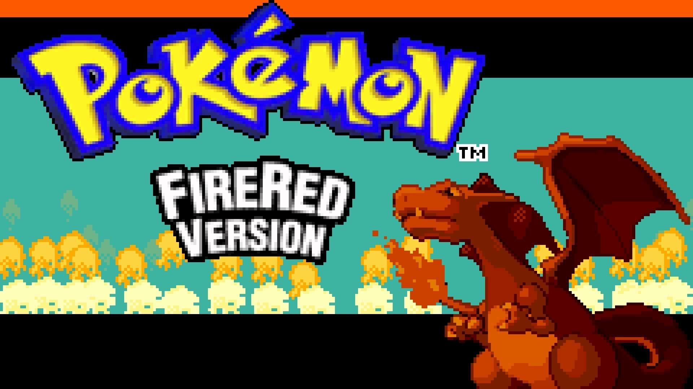
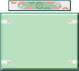

# Pokémon Go (Java PvP Battle Game)

This is a two-player Pokémon battle game developed in Java using Swing for the GUI. Inspired by the style of Pokémon Showdown, each player is randomly assigned a team of 6 final-evolution Gen 1 Pokémon. The goal: outplay and outlast your opponent through strategic move choices, type advantages, and switch-ins.

## 🕹️ Gameplay Features

- **Randomized Teams**: Each player gets 6 unique Pokémon from the Gen 1 final evolution pool.
- **Move Variety**: Pokémon have 4 moves—physical, special, or status-based—each with distinct type, power, accuracy, and PP.
- **Type Effectiveness**: Includes a full type-matching system (super effective, not very effective, no effect).
- **Priority System**: Determines who goes first based on Pokémon speed stats and swap priorities.
- **GUI-Based Gameplay**: Clickable menus and dynamic health bars built with Java Swing.
- **Battle Narration**: On-screen updates narrate each action and its effects (e.g., damage dealt, stat changes, missed attacks).
- **Victory Screen**: Displays the winner and loser at the end of the match.

## 📸 Screenshots

  
  
  
  

## 🔧 Project Structure

- `GUI.java` — Controls the main game loop and GUI interactions
- `Player.java` — Stores each player’s Pokémon team and game state
- `Pokemon.java` — Represents individual Pokémon and their stats
- `Move.java` — Stores move properties (type, category, power, accuracy, PP)
- `TypeMatching.java` — Calculates damage effectiveness based on Pokémon types
- `TypeColor.java` — Sets button colors based on move type
- `StatusMove.java` — Implements status-affecting moves (stat changes)
- `PlayerDecisionData.java` — Stores player turn decisions (move or switch)

## 📁 Resources

Ensure the following folders exist in the project directory:
- `images/` — Backgrounds, health bars, Pokémon sprites, UI assets
- `font/` — Contains `pokemon_fire_red.ttf`
- `libraries/` — Includes `Pokedex.txt`, `MoveLibrary.txt`, `TypeChart.txt`

## ▶️ How to Run

1. Make sure you have **Java 8+** installed.
2. Compile and run `GUI.java` from any Java IDE or terminal.
3. Ensure all required assets and libraries are in the correct folders (see above).
4. Enter player names → Teams are assigned → Let the battle begin!

## 🧠 Notes

- Pokémon stats scale based on randomly assigned levels (75–85).
- Stat-changing effects (like Swords Dance or Leer) are limited to 6 stages.
- Accuracy and PP are properly tracked and enforced.
- Game ends when all Pokémon on a team faint or a player forfeits.

## 📜 Credits

Developed by **Duc Minh Pham** as a high school project (ICS4U0).
This project is for educational/demo purposes only. All Pokémon assets and concepts belong to **Nintendo**, **Game Freak**, and **The Pokémon Company**.

---

